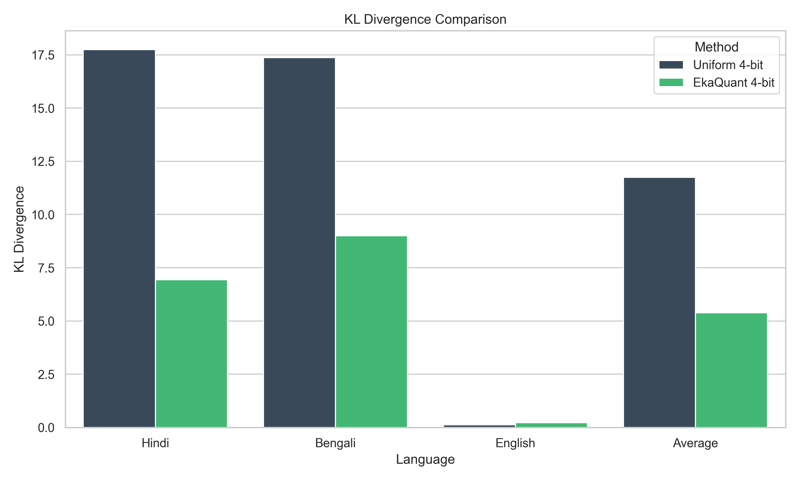
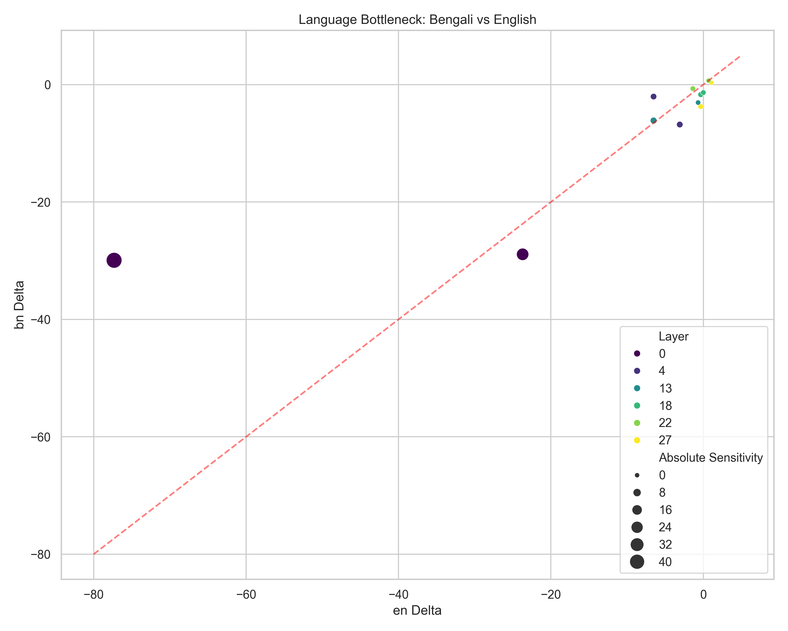
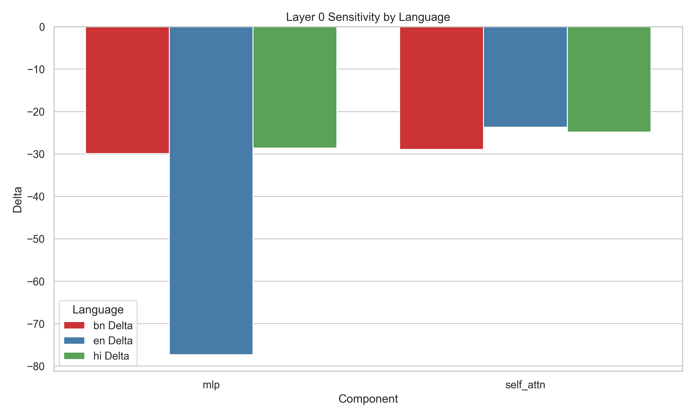
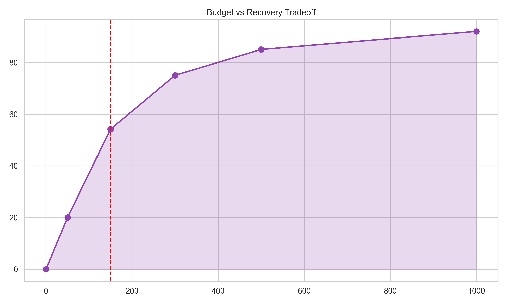
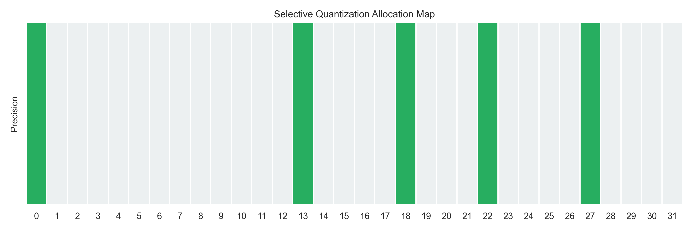

# EkaQuant: Language-Aware Selective Quantization

EkaQuant is a specialized quantization library designed to mitigate the performance loss observed during uniform low-bit quantization (e.g., 4-bit BitsAndBytes). It specifically addresses the disproportionate degradation of low-resource language representations (such as Hindi and Bengali) in Small Language Models (SLMs).

By identifying critical language-specific bottlenecks and utilizing a Knapsack-based allocation strategy, EkaQuant preserves model intelligence within a restricted VRAM budget by maintaining a small subset of mission-critical weights in high precision (fp16/bf16).

## Key Achievement: 54.16% Mathematical Recovery

Empirical validation using Mistral-7B-Instruct-v0.3 demonstrates that uniform 4-bit quantization significantly distorts the model's internal probability distributions for Indic languages. EkaQuant recovers over half of this lost fidelity by protecting less than 1.5% of the model's parameters (150 MB budget).

### KL Divergence Recovery Analysis
| Language | Uniform 4-bit KL | EkaQuant 4-bit KL | Improvement |
| :--- | :--- | :--- | :--- |
| Hindi | 17.75 | 6.93 | 60.9% |
| Bengali | 17.37 | 9.00 | 48.1% |
| English | 0.12 | 0.22 | (Baseline Robust) |
| **Average** | 11.74 | **5.38** | **54.16%** |

### VRAM Footprint Profile (Mistral-7B)
To achieve this 54% recovery, EkaQuant introduces a mathematically bounded, negligible memory overhead compared to a naive 4-bit quantization.

| Model Precision | Weight VRAM | Delta |
| :--- | :--- | :--- |
| **Pure bfloat16 (Baseline)** | ~14,000 MB | - |
| **Uniform 4-bit (BitsAndBytes)** | 3,840 MB | - |
| **EkaQuant (Task-Aware 4-bit)** | **3,990 MB** | **+3.9% (150 MB)** |

*Note: The 3.9% VRAM overhead yields a 54% reduction in mathematical error for Indic languages.*

---

## The Mechanistic Rationale: Superposition and SAEs

EkaQuant's methodology is grounded in mechanistic interpretability. In foundation models pre-trained primarily on English, robust and dedicated circuitry is formed for English concepts. In contrast, the morphological richness of low-resource Indic languages forces their representations into heavy **superposition** (sharing neurons/parameters with other concepts).

When uniform low-bit quantization (like NF4) is applied, the precision required to correctly decode these delicate, overlapping features from the residual stream is lost. 

EkaQuant acts as a structural diagnostic tool. While **Sparse Autoencoders (SAEs)** are typically used to extract monosemantic features from these superimposed activations, training SAEs for every language is computationally prohibitive. EkaQuant sidesteps this by using systematic targeted ablation to identify the specific weight matrices (the "bottlenecks") where these superimposed features are most fragile, and mathematically shields them from quantization.

*(Note: EkaQuant's core architecture was recently refactored to accept arbitrary `Callable` sensitivity metrics, meaning pre-trained SAE activation norms can be natively injected as a routing mechanism in future research).*

---

## Technical Validation and Visual Analysis

The effectiveness of EkaQuant is supported by a comprehensive suite of visual artifacts derived from a 4-hour dual-GPU interpretability sweep and KL-divergence validation.

### KL Divergence Recovery Comparison

The comparison above illustrates the significant reduction in mathematical error (KL Divergence) across target languages. EkaQuant effectively bridges the gap between heavily quantized models and their high-precision counterparts.

### Language-Specific Bottlenecks

Analysis of Bengali versus English sensitivity reveals specific modules that are critical for Indic language performance but have negligible impact on English. These modules are prioritized for high-precision preservation.

### Layer 0: The Architectural Anchor

The initial layers of the Transformer architecture exhibit extreme sensitivity to quantization. Ablation of Layer 0 components causes a near-total collapse of model performance, justifying its automatic protection in the EkaQuant strategy.

### VRAM Efficiency and Tradeoff Curve

The tradeoff curve demonstrates the high return on investment for small VRAM allocations. Protecting a minimal subset of weights (150-300 MB) yields diminishing returns for larger budgets, confirming the efficiency of the selective approach.

### Knapsack Precision Allocation

The allocation map shows the specific layers selected by the Knapsack algorithm for higher precision, concentrated in the critical anchor and mid-network bottleneck zones.

---

## Baseline Benchmarks (MMLU-IN)
The following results highlight the impact of uniform quantization on SLMs, establishing the baseline for EkaQuant's optimization.

| Model | Precision | Score |
| :--- | :--- | :--- |
| Qwen/Qwen2.5-3B-Instruct | 8-bit | 35.43% |
| Qwen/Qwen2.5-3B-Instruct | 4-bit | 30.70% |
| Qwen/Qwen2.5-7B-Instruct | 8-bit | 38.59% |
| Qwen/Qwen2.5-7B-Instruct | 4-bit | 40.00% |
| Mistral-7B-Instruct-v0.3 | 8-bit | 29.82% |

## Project Structure
- `ekaquant/`: Core library implementation.
- `scripts/`: Validation and artifact generation utilities.
- `plots/`: Detailed visual analysis and explanations.
- `data/`: Empirical sweep results and sensitivity maps.
